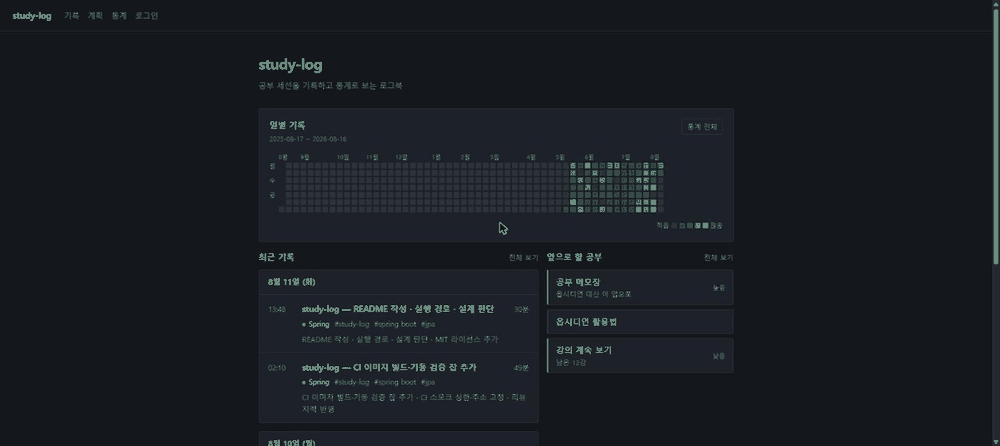
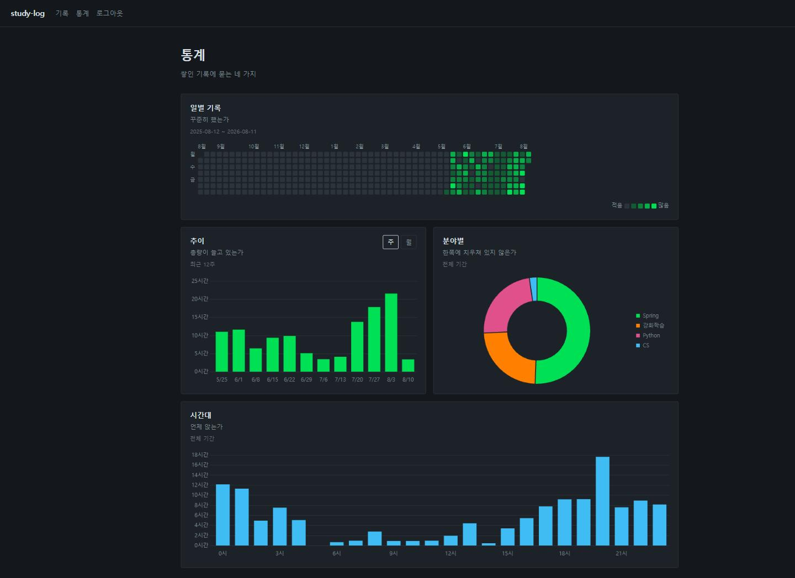

# study-log

> 공부한 시간을 세션 단위로 기록하고, 쌓인 기록에 검색·통계로 되묻는 웹 애플리케이션


마크다운 파일로 학습 노트를 쌓던 TIL 리포를 대체한다. 파일은 쓰기 편하지만 분야·기간·태그를
조합해 좁힐 수 없고, 얼마나 꾸준히 했는지도 파일 목록으로는 알 수 없다. DB 로 옮겨 검색과 통계를
얻되 **마크다운으로 다시 내보내 옵시디언 vault 로 열 수 있게** 해서 원래 쓰던 방식은 잃지 않았다.





화면에 찬 130개 세션은 더미가 아니라 실제 커밋 이력이다. 개인 리포 8개의 커밋을 90분 간격으로
끊어 세션으로 묶고 마크다운으로 만들어 `/import` 로 올렸다 — 이관 전용 도구를 따로 만들지 않은
것은 가져오기가 그 통로이기 때문.

## 기술 스택

| 구분 | 기술 |
|---|---|
| Language | Java 21 |
| Framework | Spring Boot 4.1 · Spring Data JPA · Spring Security · Validation |
| Database | PostgreSQL (운영 · 컨테이너 · 리포지토리 테스트) · H2 (로컬 · 나머지 테스트) · 스키마는 Flyway |
| View | Thymeleaf 서버 렌더링(별도 프론트엔드 빌드 없음) · Chart.js · 히트맵은 CSS Grid 자체 구현 |
| Markdown | commonmark-java 렌더링 + jsoup 새니타이즈 |
| Build · CI | Gradle · GitHub Actions · Docker Compose |

## 실행

```bash
git clone https://github.com/minky5004/study-log.git && cd study-log
docker run --rm httpd:alpine htpasswd -bnBC 10 "" 원하는비밀번호 | tr -d ':\n'
cp .env.example .env
# 출력된 BCrypt 해시를 .env 의 APP_ADMIN_PASSWORD_HASH 에 작은따옴표째 붙여넣는다
docker compose up -d        # → http://localhost:8080
```

컨테이너 없이 로컬 H2 로 띄우려면 두 환경변수를 넣고 `./gradlew bootRun`.

```bash
export APP_ADMIN_USERNAME=admin
export APP_ADMIN_PASSWORD_HASH='$2y$10$...'
./gradlew bootRun           # → http://localhost:8080
```

관리자 계정은 환경변수 전용이다 — 기본 계정을 코드에 두면 그것이 곧 리포에 공개된 자격증명이라,
두 변수가 없거나 BCrypt 해시가 아닌 평문이 들어오면 부팅이 실패한다. **해시의 작은따옴표는 벗기지
않는다.** 안에 든 `$` 를 컴포즈가 변수로 읽어 값을 잘라내는데 잘린 값도 `$2` 로 시작해 검사를
통과하므로, 앱은 멀쩡히 뜨고 로그인만 영영 실패한다 — `.env.example` 의 자리표시자를 그대로
둔 경우도 같다.

조회는 로그인 없이 열리고 작성·수정·삭제와 **내보내기·가져오기**가 로그인을 요구한다. 뒤 둘은
GET 이지만 한 요청이 DB 전량을 흘려보내거나 받는 쪽이라 화면 단위 조회와 다르게 봤다.

## 설계 판단

| 정한 것 | 왜 그렇게 했나 |
|---|---|
| 공부 시간을 저장 시점에 계산해 컬럼으로 | 통계를 열 때마다 기록 전량에서 다시 빼지 않기 위해. 종료가 시작보다 앞서면 익일로 보고, 시작과 종료가 같으면 입력을 거부한다 — 0분과 24시간을 구별할 수 없다 |
| 분야는 최초 표기 유지 · 태그는 소문자 통일 | 분야는 화면에 이름 그대로 나가고 태그는 그렇지 않다. 대소문자만 다른 분야가 통계를 가르지 않도록 중복 판정은 정규화 컬럼 `name_key` 의 unique 제약 — `lower(name)` 함수 인덱스로 대신하지 않는 것은 키 파생이 소문자화에 더해 공백 축약까지 하기 때문이다. 붙여넣은 전각 공백이 든 분야가 다른 키로 갈라지면 통계가 쪼개지고, 합칠 관리 화면은 만들지 않기로 했다 |
| 주·월·시간대로 접는 일만 DB 가 아니라 자바에서 | 날짜 함수는 H2 와 PostgreSQL 이 갈리는 자리라, 방언에 닿는 계산만 걷어내 순수 단위 테스트로 덮는다. 합계 자체는 `group by` 로 DB 가 접는다 — 그것까지 자바로 가져오면 기록 수만큼의 행이 매 요청 올라온다 |
| 스키마는 Flyway 가 만들고 하이버네이트는 대조만 | `ddl-auto=update` 로 두었을 때 실제로 물렸다 — 태그 순서 컬럼을 더하는 DDL 이 실패했는데 경고 한 줄만 남기고 부팅에 성공해, 목록이 500 인 채로 떠 있었다. `validate` 는 같은 상황에서 아예 뜨지 않는다 |
| 잔디 히트맵은 CSS Grid 자체 구현 | 칸 365개를 그리자고 Chart.js 플러그인 CDN 을 하나 더 늘리지 않는다 |
| 가져오기 배치를 한 트랜잭션으로 묶지 않음 | 남의 파일을 받는 경로라 실패가 정상 흐름의 일부다. 묶으면 100건 중 1건의 형식 오류가 나머지 99건을 되돌려, 화면에는 "성공 99" 가 뜨는데 DB 는 비어 있다. 트랜잭션 경계는 노트 하나 |

**감수한 것**

- 검색은 LIKE — `%keyword%` 는 인덱스를 못 탄다. 기록 5,000건과 검색 응답 300ms 를 전환 기준으로
  잡아 두고 그때까지는 두기로 했다. 한국어 전문검색은 `pg_bigm` 같은 확장이 필요해, 올릴 곳이
  확장 설치를 허용하는지가 선행 조건이다
- 리포지토리 테스트는 실제 PostgreSQL 위에서 돈다. 인메모리 H2 로 두었다가 방언 결함을 두 번
  놓쳤기 때문이다 — 검색 파라미터의 `lower(null)` 이 `bytea` 로 추론된 건, 기간 필터의 파라미터
  타입이 정해지지 않아 날짜를 넣은 검색이 전부 500 이던 건. 대가는 `./gradlew build` 의 도커 의존
- 공개 URL 이 없다 — 무료 상시가동 경로가 전부 결제 카드를 요구해서, 돌아간다는 근거를 위 화면
  이미지와 아래 실행 예시에 걸었다

## 구조

```
domain/               엔티티 · 자정 넘김 시간 계산 · 태그 순서 컬럼
repository/           조회 · 통계 group by
service/              CRUD · 분야/태그 정규화 · 통계 집계 · 마크다운 렌더 + 새니타이즈
service/export/       기록 → YAML 프론트매터 마크다운 ZIP
service/importer/     마크다운 ZIP → 기록 (노트 하나가 트랜잭션 하나)
web/                  컨트롤러 · 폼 DTO · 통계 JSON(/api/stats)
resources/templates/  logs · stats · io · 공통 layout
```

## 검증

| 무엇을 | 어떻게 |
|---|---|
| 단위·통합 테스트 222개 | `./gradlew test --rerun-tasks` 31초 · 전부 통과 · 리포지토리 18개는 PostgreSQL 컨테이너 위 |
| 백업이 실제로 복구되는가 | 내보낸 ZIP 을 비운 DB 에 되넣어 원본과 일치 · 같은 ZIP 재업로드는 전건 건너뜀 (`MarkdownRoundTripTest`) |
| 이미지가 PostgreSQL 위에서 뜨는가 | CI `image` 잡이 compose 로 띄워 앱 healthcheck 가 healthy 를 낼 때까지 기다린 뒤 `GET /logs` 200 확인 — 1분 33초 (run 31493666543) |
| 실제 데이터로 화면이 차는가 | 커밋 이력에서 만든 마크다운 130개를 `/import` 업로드 — 추가 130 · 건너뜀 0 · 실패 0 |
