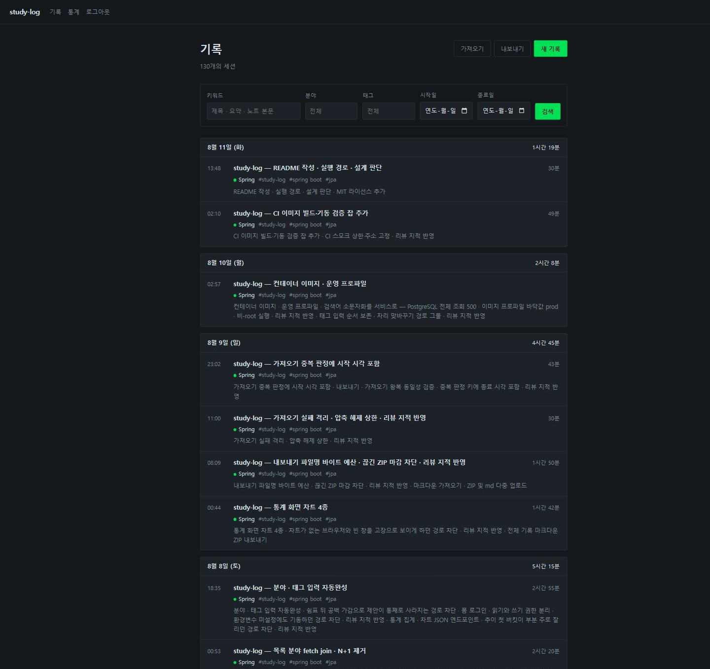
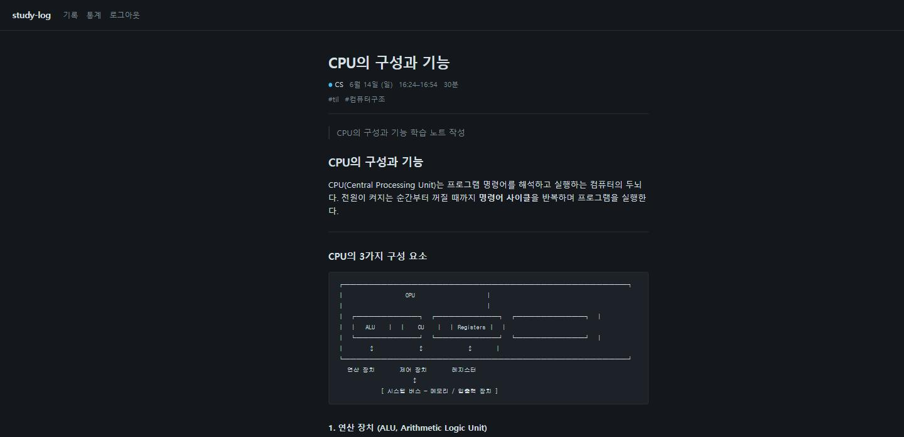

# study-log

> 공부한 시간을 세션 단위로 기록하고, 쌓인 기록에 검색·통계로 되묻는 웹 애플리케이션


마크다운 파일로 학습 노트를 쌓던 TIL 리포를 대체한다. 파일은 쓰기 편하지만 분야·기간·태그를
조합해 좁힐 수 없고, 얼마나 꾸준히 했는지도 파일 목록으로는 알 수 없다. DB 로 옮겨 검색과 통계를
얻되 **마크다운으로 다시 내보내 옵시디언 vault 로 열 수 있게** 해서 원래 쓰던 방식은 잃지 않았다.


| 기록 목록 | 노트 상세 | 통계 |
|---|---|---|
|  |  |  |

화면에 찬 130개 세션은 더미가 아니라 실제 커밋 이력이다. 개인 리포 8개의 커밋을 90분 간격으로
끊어 세션으로 묶고 마크다운으로 만들어 `/import` 로 올렸다 — 이관 전용 도구를 따로 만들지 않은
것은 가져오기가 그 통로이기 때문.

## 기술 스택

| 구분 | 기술 |
|---|---|
| Language | Java 21 |
| Framework | Spring Boot 4.1 · Spring Data JPA · Spring Security · Validation |
| Database | PostgreSQL (운영 · 컨테이너) · H2 (로컬 · 테스트) |
| View | Thymeleaf 서버 렌더링 · Chart.js · 히트맵은 CSS Grid 자체 구현 |
| Markdown | commonmark-java 렌더링 + jsoup 새니타이즈 |
| Build · CI | Gradle · GitHub Actions · Docker Compose |

React 등 별도 프론트엔드 빌드를 두지 않는 서버 렌더링 단일 배포다.

## 실행

```bash
git clone https://github.com/minky5004/study-log.git && cd study-log
cp .env.example .env
docker run --rm httpd:alpine htpasswd -bnBC 10 "" 원하는비밀번호 | tr -d ':\n'
# 출력된 BCrypt 해시를 .env 의 APP_ADMIN_PASSWORD_HASH 에 붙여넣는다
docker compose up -d        # → http://localhost:8080
```

컨테이너 없이 로컬 H2 로 띄우려면 두 환경변수를 넣고 `./gradlew bootRun`.

```bash
export APP_ADMIN_USERNAME=admin
export APP_ADMIN_PASSWORD_HASH='$2y$10$...'
./gradlew bootRun           # → http://localhost:8080
```

관리자 계정은 환경변수로만 받는다. 기본 계정을 코드에 두면 그것이 곧 리포에 공개된 자격증명이
되므로, 두 변수가 없으면 부팅이 실패한다. 평문이 아니라 BCrypt 해시(`$2` 로 시작)를 넣어야 하는데
평문을 넣으면 앱은 정상 기동하고 로그인만 계속 실패하므로 이것도 부팅 단계에서 거부한다.
조회 화면은 로그인 없이 열리고 기록 작성·수정·삭제만 로그인을 요구한다.

## 설계 판단

| 정한 것 | 왜 그렇게 했나 |
|---|---|
| 공부 시간을 저장 시점에 계산해 컬럼으로 | 통계를 열 때마다 기록 전량에서 다시 빼지 않기 위해. 종료가 시작보다 앞서면 익일로 보고, 시작과 종료가 같으면 입력을 거부한다 — 0분과 24시간을 구별할 수 없다 |
| 분야는 최초 표기를 유지하고 태그는 소문자로 통일 | 분야는 화면에 이름 그대로 나가고 태그는 그렇지 않다. 대소문자만 다른 분야가 통계를 가르지 않도록 중복 판정은 정규화 컬럼 `name_key` 의 unique 제약 — `lower(name)` 함수 인덱스는 JPA 스키마 생성으로 표현할 수 없다 |
| 주·월 버킷팅과 시간대 분포는 DB 가 아니라 자바에서 | H2 와 PostgreSQL 의 날짜 함수 방언 차이를 지우고 순수 단위 테스트로 덮기 위해. 일별·분야별 합계만 `group by` 로 DB 에 맡긴다 |
| 잔디 히트맵은 CSS Grid 자체 구현 | 칸 365개를 그리자고 Chart.js 플러그인 CDN 을 하나 더 늘리지 않는다 |
| 가져오기 배치를 한 트랜잭션으로 묶지 않음 | 남의 파일을 받는 경로라 실패가 정상 흐름의 일부다. 묶으면 100건 중 1건의 형식 오류가 나머지 99건을 되돌려, 화면에는 "성공 99" 가 뜨는데 DB 는 비어 있다. 트랜잭션 경계는 노트 하나 |

**감수한 것**

- 검색은 LIKE — 기록이 수천 건인 개인 도구 규모에서는 인덱스 없이도 돌고, 전문검색으로 옮길
  기준은 따로 잡아 두었다
- 테스트는 인메모리 H2 전용이라 PostgreSQL 방언 계약이 그물 밖이다. 실제로 검색 쿼리의
  `lower(null)` 이 `bytea` 로 추론돼 목록 첫 화면이 통째로 500 이던 결함을 컨테이너에서 처음 만났다
- 공개 URL 이 없다 — 무료 상시가동 경로가 전부 결제 카드를 요구해서, 돌아간다는 근거를 위 화면
  이미지와 아래 실행 예시에 걸었다

## 구조

```
domain/          엔티티 · 자정 넘김 시간 계산 · 태그 순서 컬럼
repository/      조회 · 통계 group by
service/         CRUD · 분야/태그 정규화 · 통계 집계 · 마크다운 렌더 + 새니타이즈
service/export/  기록 → YAML 프론트매터 마크다운 ZIP
service/importer/ 마크다운 ZIP → 기록 (노트 하나가 트랜잭션 하나)
web/             컨트롤러 · 폼 DTO · 통계 JSON(/api/stats)
resources/templates/  logs · stats · io · 공통 layout
```

## 검증

| 무엇을 | 어떻게 |
|---|---|
| 단위·통합 테스트 217개 | `./gradlew test --rerun-tasks` 25초 · 전부 통과 |
| 백업이 실제로 복구되는가 | 내보낸 ZIP 을 비운 DB 에 되넣어 원본과 일치 · 같은 ZIP 재업로드는 전건 건너뜀 (`MarkdownRoundTripTest`) |
| 이미지가 PostgreSQL 위에서 뜨는가 | CI `image` 잡이 `docker compose up` 으로 띄워 `GET /logs` 200 까지 확인 — 1분 23초 (run 31423242374) |
| 실제 데이터로 화면이 차는가 | 커밋 이력에서 만든 마크다운 130개를 `/import` 업로드 — 추가 130 · 건너뜀 0 · 실패 0 |
